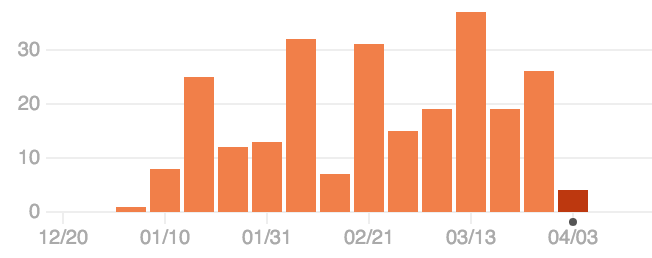
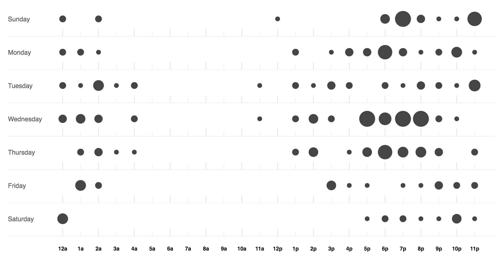

# Version Control
Version control is a big part of the project. All of the source for the project is version controlled by git. There is no strict workflow implemented for the project since it's a one man team however there were some rules when working with the code.

1. **`master` and `develop` branches.**
	
	The `master` branch always represented a stable, functioning application at any point in time (merge commits only). The `develop` branch represents the application at any state during development. You can expect to find a buggy app where somethings may be broken and other unfinished.

2. **Branching for new features or refactors.**

	For each new feature, a new branch is created under the feature name. All code for that feature is contained within that branch. Sometimes some features cannot be developed in isolation, if that is the case a new branch is to be created from `develop` and merged into `develop` on completed, then merged into the blocked feature branch. It is often hard to describe the scope of a feature so this is entirely left up to the developer.
	
3. **Detail the commit logs.**

	The commit messages should contain enough detail for anyone browsing the history to understand what was updated or added in the changes. This sometimes became tedious and when it did, it breaking the commit up into smaller chunks and committing more often.
	
### Github
The entire codebase is hosted on Github. This served as a backup for the repository and facility for third party services to interact with the project. Gitbook, the software that built this book takes the `report/` directory from Github, compiles the book and puts it online for anyone to read. Codeship, the continuous integration service, uses the Github API to listen for commits and run the projects tests automatically. This is detailed further in the Continous Integration section of the Testing chapter.

### Statistics
These are some statistics on the repository pulled from Github.


<center><i>Some commit and language statistics.</i></center>

<div>

<div style="width:40%; float: right;">
<center><i>Commit frequency.</i></center></div>
<div style="width:60%;">
<center><i>Code frequency.</i></center></div>
</div>


<center><i>Repository punchcard. Not a morning person.</i></center>

### Notable Commit Logs
Throughout the history of the project, there were some milestones achieved that really helped motivate the development.

```
commit 89e0700cede400fe2570943a27567810c13987bf
Author: Adrian Cooney <cooney.adrian@gmail.com>
Date:   Fri Mar 25 17:42:36 2016 +0000

    Migration with new inheritance based model.

    This converts all existing questions in the database to the new entity
    model. It does the following things:

    1. Drop all foreign keys reference the questions table (including circular keys).
    2. For each question, create an entity.
    3. If the question has a parent, find the parent entity id and set it.
    4. Recreate all foreign keys.
```
<center><i>Implementing the inheritance based model with SQL Alchemy (<a href="https://github.com/adriancooney/examist/commit/89e0700cede400fe2570943a27567810c13987bf">link</a>)</i></center>

```
commit 414747241536ff3db0746a877a45b43c9e1ae244
Merge: 54ebcc4 6fdb0df
Author: Adrian Cooney <cooney.adrian@gmail.com>
Date:   Thu Jan 28 14:51:05 2016 +0000

    Merge branch 'redux'.

    Finally confident enough with Redux to use it as the library behind
    the app for managing data. Although it requires a lot of boilerplate
    and some, at times, frustrating logic it's extremely robust and to the
    very core, simplistic.
```
<center><i>Finished testing with Redux and satisfied it will suit the project. (<a href="https://github.com/adriancooney/examist/commit/414747241536ff3db0746a877a45b43c9e1ae244">link</a>)</i></center>

```
commit 50bad3b898fae55aa354720dd2b227e55de8947b
Author: Adrian Cooney <cooney.adrian@gmail.com>
Date:   Thu Jan 21 17:50:38 2016 +0000

    Better styling system with SASS and new global, colors, fonts SCSS.

    Introduced a new styling system where (if preferred), components
    can be styled by creating a SCSS file under the package name. e.g.
    If we had the components:

        src/error/ErrorMessage.jsx
        src/error/Error404.jsx

    Each still have their own class `.ErrorMessage` and `.Error404` (if a
    component in their own right) but we create a single file called
    `Error.scss`, which is the name of the folder. This file is then placed
    in the corresponding style directory where the `error` folder would
    appear. In this case, it would be `style/Error.scss` since the `error`
    directory is at the root of the source.

    I also created the following files:

    * `Global.scss` - For style tags, wildcards etc.
    * `common/Colors.scss` - For holding the colors of items.
    * `common/Fonts.scss` - Describe the fonts for items.
    * `common/Spacing.scss` - (Experimental) Global spacing style.
```
<center><i>Introducing SASS and styling system for components. (<a href="https://github.com/adriancooney/examist/commit/50bad3b898fae55aa354720dd2b227e55de8947b">link</a>)</i></center>

```
commit a0db2d317210ca1b0020aef725ab43f527222d03
Merge: 927d098 b78d44c
Author: Adrian Cooney <cooney.adrian@gmail.com>
Date:   Wed Feb 24 21:05:01 2016 +0000

    Merge branch 'the-big-refactor' into develop.

    This was a HUGE refactor that took the guts of an hour combing through
    EVERY FILE in the project. All because of one silly global in
    JS called `module` that clashed with our version of a "module" e.g. CT475.

    This merge removes all instances of the `module` and it's variants and
    replaces it with **Course**. Since the database was altered, it was
    easier to recreate all the data from scratch the run migrations in
    alembic.
```
<center><i>The name "module" caused havoc in JS code since it was a reserved word. <br> This refactor renamed "module" to "course" throughout the entire app. (<a href="https://github.com/adriancooney/examist/commit/a0db2d317210ca1b0020aef725ab43f527222d03">link</a>)</i></center>