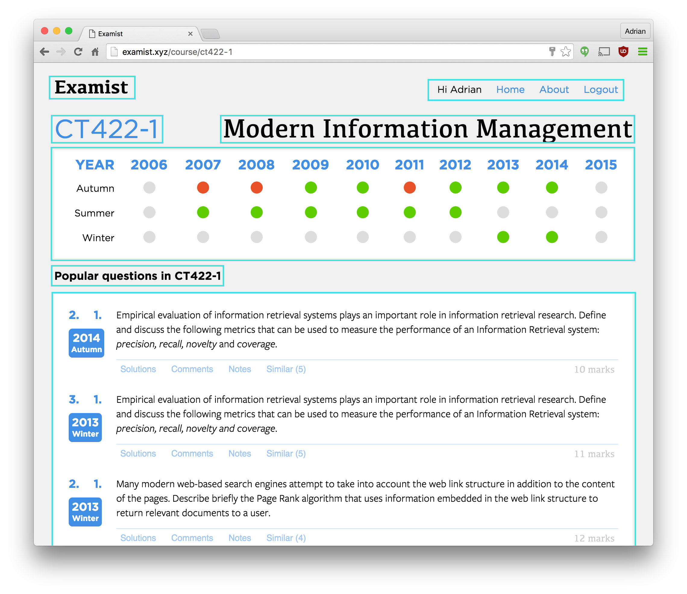
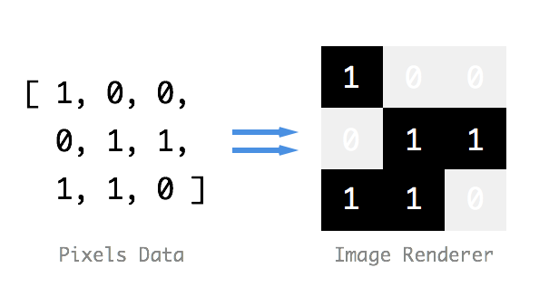
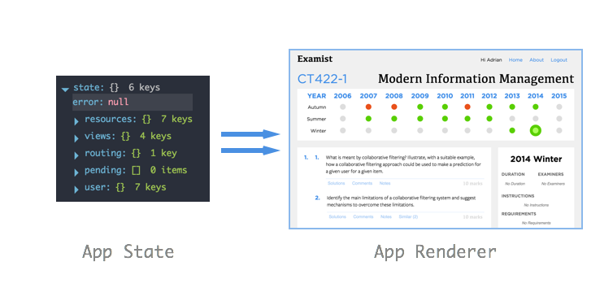

# User Interface


The User Interface (UI) of the application is built using React. React is a state of the art abstraction that works on top of, but not limited to, the Document Object Model (DOM) of the browser. React introduces a new syntax called JSX where you can declaratively construct you application's view using XML (or HTML):

```js
function PaperLink(props) {
	const { course, paper } = props; 
	const link = `/course/${course.code}/paper/` + 
		`${paper.year_start}/${paper.period}`;

	return (
		<div className="PaperLink">
			<CourseLink course={course} />
				<div className="paper-detail">
					<h4><Link to={link}>{ paper.year_start }</Link></h4>
					<h5><Link to={link}>{ capitalize(paper.period) }</Link></h5>
				</div>
			</div>
		</div>
	);
}
```
<center><i>Example of a real component within the app using React and JSX.</i></center>

### Components
The entire UI of the application is based on components. A component is a small piece of the interface that follows the Single Responsibility Principle (Hunt, 2016). The component should only do one thing and when it grows large, it should be decomposed into smaller components. Components represent every part of the user interface from the buttons to comment forms to page footers.


<center><i>Outline of top level components within the Course component.</i></center>

### Single, Global, Immutable State
Normally with React, each component has it's own state and can update or modify by itself. This is useful for handling small user interactions like keyboard input or mouse clicks however within the scope of the entire app, local state can be dangerous. Local state allows the application to take on an infinite state space when composing the components. This is bad for testing and building user interfaces because it's impossible to ensure every state is handled correctly. To avoid this, the project uses a library called Redux.

#### Pure UI
Redux, at first, is hard to understand. Redux forces the application state to be held in one single, global, immutable object. This state, is then the sole source of truth for the app and defines the view. It can't be stressed enough, **the state defines the view**.

A useful analogy to help understand what *the state defines the view* means is to take any black and white image. The *state* of that image is the pixel data which is represented by an array of `1` and `0`s. This state is then passed to an image renderer who will produce a static image. What's important to note here is that given the same pixel state, the renderer will **always produce the same image** no matter what. 

<center></center>

With Redux, we take this concept and apply it to our user interface. The application state is the pixel array and the React app is the image renderer. **Given an application state, the renderer will always render the same view.** This is what it means by *the state defines the view*.

<center></center>

Once this concept is understood, the next logical question is how to modify the state to change the app. This brings us onto our next two concepts, **actions** and **reducers**.

#### Actions
Actions are how the state of the app is modified. They communicate to the state that something has occurred and pass any information that the state needs to update in response to the action. This concept may seem confusing at first however it becomes clear when we look at how reducers work. For now, think of an action as a simple, atomic object with a `type` that uniquely identifies that specific action:

```js
{
	type: "OPEN_PAPER",
	payload: {
		paper_id: 34
	}
}
```

#### Reducers
Reducers are how we *construct* the final state representation before it is passed to the view. As the name suggests, reducers work on the same way as the familiar "reduce" concept by taking a value and reducing it to a single value. The reducer takes the state of the application and *reduces* it in response to an *action*.

For example, when the above action `OPEN_PAPER` is dispatched to the state, the reducer receives it and returns a new state in response to that action. This means updating the view to display the paper with ID of 34.

```js
function paperViewReducer(state = {}, action) {
	return { current_paper: action.payload.paper_id };
}
```

This new, reduced state is then passed to the view for rendering. It's extremely important to the understanding of Redux is that the state can only change in response to actions. Reducers also have to be **pure functions**. A pure function is a function that's value is determined solely on the parameters passed. This characteristic is important to reducers to ensure that the view is always defined by actions and actions alone. With this background in mind, hopefully you will understand the Redux's three principles (Abramov, 2016) (copied verbatim from the documentation):

1. **Single source of truth.**

	The state of your whole application is stored in an object tree within a single store.

2. **State is read-only.**

	The only way to mutate the state is to emit an action, an object describing what happened.	
	
3. **Changes are made with pure functions.**

	To specify how the state tree is transformed by actions, you write pure reducers.

### Application State & Actions
The application state is defined by the reducers and actions in the `model` directory. The reducers are collected at runtime time and combined to created to reduce to a single state object. Whenever an action is dispatched, it is passed to each reducer which processes the action and returns it's new state. Each reducer's new state is combined until the full application state is formed.

#### Async actions
Asynchronous actions are tricky in Redux because they require two actions. One to tell the state the async task has started (display loading symbols etc.) and another telling the task is complete with the data returned (display fetched content). This is done for each network request within the app and spawned the now published library [`redux-pending`](http://github.com/adriancooney/redux-pending).

The redux pending library takes a [Javascript Promise](https://developer.mozilla.org/en/docs/Web/JavaScript/Reference/Global_Objects/Promise), dispatches an action to the state to notify the promise has begun execution and again when the promise has completed execution with the return value as the `payload` of the action.

### Smart & Dumb Components
Not all the components need to talk to the global application state. In fact most *never* communicate or touch it whatsoever. These are called "dumb" components. They render what data is passed to them and no more. Dumb components can be placed anywhere within the app and always function the same. These components should never handle user actions, they should pass that responsibility to the parent component by way of passing event handlers.

"Smart" components are components that communicate and mutate the state based on actions. Smart component connect and listen to state changes and update the view accordingly. They are made up of a collection of dumb components and pass state to these components for rendering.