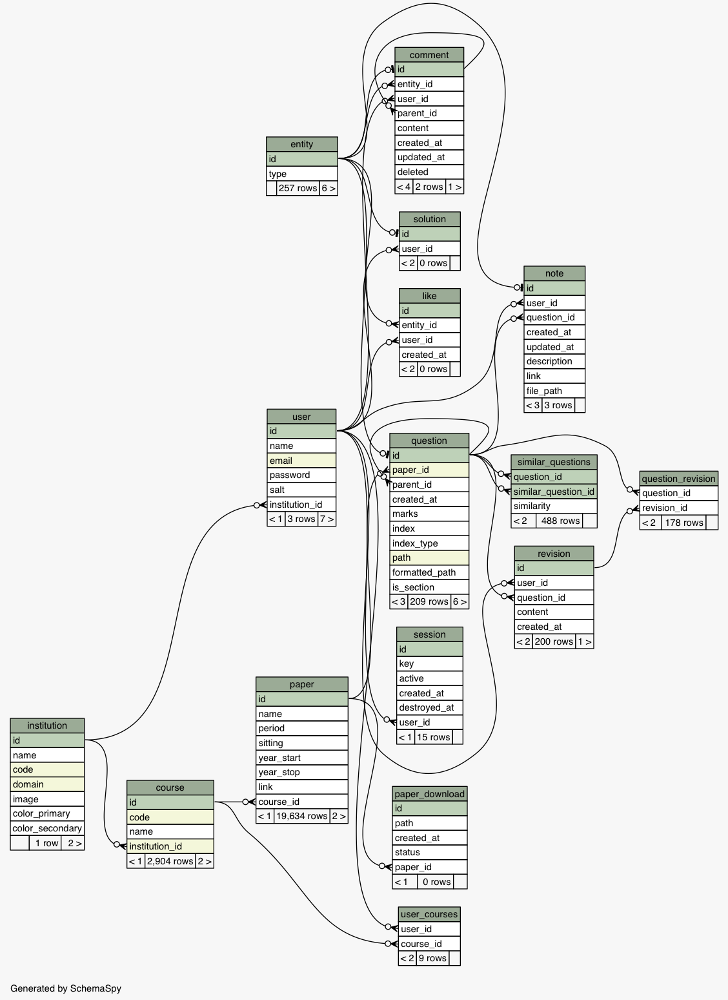

## 2.2 Database

<center><i>The database ER diagram.</i></center>

[Browse the database structure online.](http://adriancooney.ie/examist/research/database/ad04219e530a/public/index.html)

### Overview
The database uses a relational model and has 16 tables in total (17 including the table created by the migration tool, Alembic). A relational model was chosen based up the type of data to be inserted into the database. The entire database (aside from `alembic_version`) is constructed by SQL Alchemy. No manual schema creation SQL needs to be written. See Migrations section in Development chapter for creating the database.

| Table name         | Description                                       |
|--------------------|---------------------------------------------------|
| entity             | Source of IDs for all entities.                   |
| institution        | Collection of institutions (NUI Galway etc.)      |
| user               | User database.                                    |
| course             | Courses for each institution.                     |
| paper              | Papers for each course.                           |
| question           | Questions for each paper.                         |
| comment            | Comments for each entity.                         |
| revision           | Question content for each question                |
| paper_download     | Locations of each downloaded paper (legacy).      |
| session            | User's login sessions.                            |
| like               | Likes for each entity.                            |
| question_revision  | Current revision for each question.               |
| similar_questions  | Similarity index between questions.               |
| solution           | Solutions for questions.                          |
| user_courses       | User's courses.                                   |
| note               | Notes for questions.                              |
| alembic_version    | Utility table for database migration tool.        |

### Entity Inheritance Model
The most complex configuration within the app is the entity inheritance model. In code, it implements some polymorphism trickery and dynamic insert queries however in database terms, it's relatively simple. For the sake of clarity, it is understood that each model in the database could be considered an `entity` however not all implement the *entity inheritance model*. This is SQL Alchemy terminology and is explained in the Model section in the Implementation chapter. Entities in the entity inheritance model are *things* (for lack of a better word) that obtain their identifier from the `entity` table. 

Each entity's identifier column (always named `id`) is a foreign key to the `id` column in the `entity` table. Anytime a new entity is created, a new row in the `entity` table is created and linked back to the type of class. The `type` (or discriminator) column of the `entity` table specifies how the ORM should `JOIN` the `entity` table to load it's actual data. For example, take the Question entity which has a `type` of "question". Any queries related to that entity join onto the `question` table to return the question data.

The project uses the Entity Inheritance Model to allow for polymorphic operations on different types of data. These operations are *liking* and *commenting* on different things. By using this system, it allows the server to create a single `comment` table instead of multiple many-to-many relationship tables `question_comments`, `solution_comments` and `note_comments`. With the single table, the API can create a new row in the `comment` table referencing that entity and let the ORM do all the hard, relationship loading work when querying in the future.

### Self-referential Lists
Another complex configuration, this time in both code and database terms, is the self-referential lists. Also called adjacency lists, these are in essence what most graph databases do at a most basic level. It allows applications to build trees of relationships from one item in the table to another item in the same table.

In this project, both the `comment` and `question` table use the adjacency list configuration. Both use cases are identical: **nesting**. Each question can have many sub-questions which can also have sub-questions. This can create a deeply nested tree structure that needs to be represented in the database. To store these relationships, each question has a `parent_id` column which is a foreign key to the `id` column in the same table, `question`. The foreign key ensure the data integrity and also helps avoid breaking parent-child chains by deleting parents who still have children creating orphan questions. The loading techniques for Self-referential lists is described in the Models section in the Implementation chapter.

<center>
	
	<p><i>Both the entity inheritance model and the self-referential list systems in the comment table.</i></p>
</center>

<div style="page-break-after: always;"></div>

### User Data and Login
The user login system for the application is pretty basic in that it meets expectations for handling sensitive user data such as passwords. Each user has a `salt` and `password` column that contain a secure hash of their password. These hashes are created when the user signs up and only change when the user updates their password. These are *required* fields for the user table as well as their email, which also has a `unique` constraint.

User logins are saved in the `sessions` table. Each session has a unique hash that is created each time the user logs in. This token is passed to the user, saved on their client and used to identify their sessions. It acts like a temporal API key. The table configuration is again fairly simplistic for the current needs of the application and only stores the hash, timestamps and whether it is active or not. The plan for the future is to track page views along with all user actions and attach to the specific user's sessions. This will help prevent malicious activity and spam.

A more detailed explanation of how user data and sessions are handled is in the Authentication section of the Implementation chapter. 

### Revision system
Since the question and solution content is both open to anyone to edit and critical to the experience of the application, it is important to protect the data from abuse. With the manual editor of the exam papers, the contents of the papers are entirely crowd-sourced. As a consequence of crowd-sourcing, there will be users and spammers who will corrupt some valid question data malicious intent. To account for this, the application has implemented a wiki style revision system where any changes to the question or solution content is stored, in its entirety, in the `revision` table. The `revision` table has a `TEXT` column called `content` which, as labelled, contains the content being stored. To store what is the *current revision* of the question, a `question_revision` table maps the question to the current revision.

Note: As of writing, the revision system has not yet migrated to the entity inheritance model and is in it's current state, only traking revisions for `question` content. This is legacy behaviour that has not been updated to work with solutions.

### Similarity
The final item worth noting about the database is the similarity system. It contains information on how similar questions are with each other. Currently, the scope of a question's similarity is to any questions within the same course however that could well be expanded to the entire corpus which might yield interesting results. The `similar_questions` table stores this information by referencing the two questions, `question_id` and `similar_question_id` alongside a `similarity` float. With this configuration, some interesting queries such to retrieve the similar of questions are possible. For example, to retrieve the most popular questions in a course:

```sql
SELECT question_id, sum(similarity) AS similarity FROM similar_questions as sq
    INNER JOIN question ON (sq.question_id = question.id)
    INNER JOIN paper ON (question.paper_id = paper.id)
    INNER JOIN course ON (paper.course_id = course.id)
    WHERE similarity > 0.6 AND 
        sq.question_id != sq.similar_question_id AND
        course.code = 'CT422' 
    GROUP BY question.id
    ORDER BY similarity DESC;
```