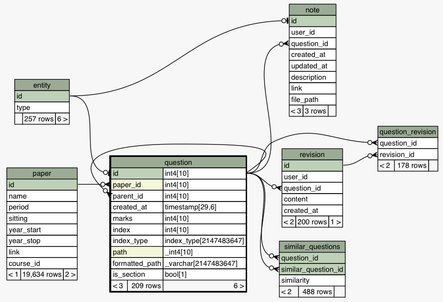

# Migrations
As with the development of any project, requirements change. This is especially true with databases. New features often require storing new data of unknown format and the database must adapt to the new requirements. This is where we introduce database migrations. This is a practice seen in large scale application deployment where an existing database needs to be upgraded to a different schema.

This project uses the migration tool **Alembic**. Its based on the SQL Alchemy library and authored by the same person. Alembic is essentially version control for you database. Each time a model is updated in the server, Alembic will detect the differences from the existing database and auto-generate the SQL to migrate the schema to the newly defined schema. These migrations are stored in the [`server/migrations/versions`](https://github.com/adriancooney/examist/tree/master/server/migrations/versions) folder as python files.

```sh
$ cd server/migrations/
$ alembic history
27d9b0a51afe -> ad04219e530a (head), Notes table.
eadd37a9a581 -> 27d9b0a51afe, Adding is_section flag to question model.
cf2e840ef9ee -> eadd37a9a581, Question similarity.
f724ae8ee68a -> cf2e840ef9ee, New entity inheritance model and migrating questions.
4c21720db4f0 -> f724ae8ee68a, Questions and revisions.
6598bfa4b4e8 -> 4c21720db4f0, Adding PDF paper downloads and conversion to HTML.
3e4c70155c23 -> 6598bfa4b4e8, Adding unique constraint to table.
009921b01ab6 -> 3e4c70155c23, Paper table.
9633df0d8a5e -> 009921b01ab6, Adding courses.
<base> -> 9633df0d8a5e, Users, sessions and institutions.
```
<center><i>The version history of the database with Alembic.</i></center>

The models in the project changed often and migrations tool was great for providing some 	piece of mind with the data. It ensured data integrity and the database was reliably migrated. Most of the time, each modification to the database could be done by running:

However, there were times when the new schema clashed with the existing data. Alembic was especially useful when migrating existing questions to the entity inheritance model.

### Migrating to the Entity Inheritance Model
A pivotal point in the evolution of the database design was when the Entity inheritance model was introduced. The new design changes were especially severe on the `question` table which, at the time, stored each question individually with their own `id`.


<center><i>The question table design before the entity inheritance model.</i></center>

With the new entity inheritance model, things that needed the comment and like functionality needed to become an *entity*. 
 

<center><i>The question table design after the entity inheritance model was implemented.</i></center>

To convert the existing questions in the question table, each question now had to create an ID within the `entity` table to satisfy the foreign key. This by itself would have made it a simple upgrade because it's just a one-to-one mapping however the question table also a self-referential column `parent_id` to allow for nesting. This made the upgrade a little tricky. It required traversing up the question tree to finding the root questions, migrating those to the entity table and then moving each child individually while also keeping track of their parents. The full migration implementation is in [server/migrations/versions/cf2e840ef9ee_.py](https://github.com/adriancooney/examist/blob/master/server/migrations/versions/cf2e840ef9ee_.py).

<aside>
	<p>Alembic was used to time-travel back to the database state before the entity inheritance model was implemented to generate the ER Diagram seen above.</p>
</aside>