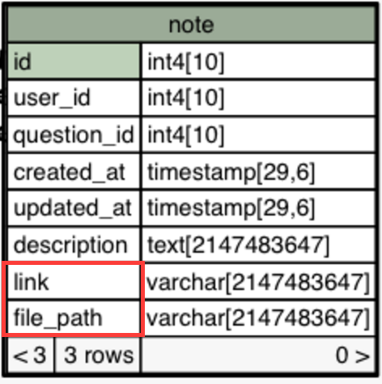

## 3.2 Backend
The backend of the app is a Python codebase contained in the `server/` directory of the project. It powers the API the frontend communicates with to run the application.

### Models
Overall, there are 14 models at the current time of writing. The names of each model are pretty much self explanatory. For a more in-depth look at the relationship configurations between the models, see the Database section of the Design chapter.

* `comment.py`
* `course.py`
* `entity.py`
* `institution.py`
* `like.py`
* `note.py`
* `paper.py`
* `paper_download.py`
* `question.py`
* `revision.py`
* `session.py`
* `solution.py`
* `user.py`

A model inherits from the SQL Alchemy *declarative base*. This is the base that communicates with the ORM to create the tables and essentially notify it that the model exists. A model also has a `__tablename__` which describes the table where the model will be stored. To construct a model, attributes are added mapping the column names in the database to the attributes in the class. 

```py
class Note(Entity, Serializable):
    __tablename__ = "note"
    id = Column(Integer, ForeignKey("entity.id"), primary_key=True)
    user_id = Column(Integer, ForeignKey("user.id"))
    question_id = Column(Integer, ForeignKey("question.id"))
    created_at = Column(DateTime, default=datetime.utcnow)
    updated_at = Column(DateTime, onupdate=current_timestamp())
    description = Column(Text)

    question = relationship("Question", foreign_keys=question_id)
    user = relationship("User", backref="notes")
```
<center><i>The Note model from the Server</i></center>

Relationships can be easily created using the `relationship` function which can also created back references on the model linked. ForeignKeys and other modifiers are all made extremely simple.

<div style="page-break-after: always;"></div>

#### Serialisation & Deserialisation
The entity serialisation and deserialisation was a particularly tough problem to solve. Python objects are not natively serialisable like the Javascript counter part. On top of that, the attributes on the entities weren't really attributes in the Python sense of the word but were describing attributes for the database. 

After some searching for some serialisation library, Marshmallow turned up looking the most reliable. Large community with an active repository and good documentation were good signs the project is still alive and well. It also has a nice API for the serialisation and deserialisation (or "dumping" and "loading" in Marshmallow terminology). To serialise an object, a schema must be defined:

```py
modelSchema = marshmallow.Schema({
	"name": fields.Str(),
	"age": fields.Int()
})
```

This became tedious because a schema had to be created for every model in the application and be update anytime they were changed. This wouldn't do when the schemas were already defined in SQL Alchemy. A schema builder was built that would take the SQL Alchemy model and produce the Marshmallow schema equivalent. The generated schema was then stored in a `__schema__` magic attribute on each SQL Alchemy model. This functionality was added to a model whenever it subclassed `server.library.model.Serializable` (as seen above in the `Note` model).

To complete the new serialisation system, a `DynamicJSONEncoder` was introduced that subclassed Python's native `JSONEncoder`. When the `DynamicJSONEncoder` encountered any SQL Alchemy object that was serialisable, it would return the serialised result instead of letting Python handle it natively. The new encoder was then handed of to Flask as the default JSON encoder. The dynamic encoder allowed for simply returning SQL Alchemy models in the API and the result would be converted to JSON. Even collections were automatically handled and some sensitive fields such as `password` could be marked hidden.

```py
@app.route("/paper/<code>")
def get_papers(code):
	papers = db.session.query(Paper).filter(Course.code == code).all()
	
	return respond({ "papers": papers })
```
 
#### Entity inheritance Model Loading
One of the would-be complicated aspects of the server was greatly simplified by SQL Alchemy, the Entity Inheritance Model. This model is explained fully in the Database section of the Design chapter however it did not explain the loading techniques.

Using the above `Note` as the example, we'll take it's sister models `NoteLink` and `NoteUpload`. The note link is simply a link on the internet that is good learning material for a question which a note upload is an uploaded piece of learning material. Both are extremely similar and only differ in two attributes, the `link` for the `NoteLink` and `file_path` for the `NoteUpload`. Here is the implementation for the classes:

```py
class NoteLink(Note, Serializable):
    __mapper_args__ = {
        "polymorphic_identity": "note_link"
    }

    link = Column(String)

class NoteUpload(Note, Serializable):
    __mapper_args__ = {
        "polymorphic_identity": "note_upload"
    }

    file_path = Column(String)
```
<center><i>Implementation of the <code>NoteLink</code> and the <code>NoteUpload</code>. Right below, the Note database table.</i></center>



See how both the model's *subclass* the `Note` class and both add an extra attribute. SQL alchemy understands this configuration and stores the both attributes in the parent `Note` table at the cost of normalisation. 

SQL Alchemy will load the *correct* classes for each `Note` object returned from the database. If a row is a note link in the database, SQL Alchemy will return a `NoteLink` object. The reason it is able to do this is because it picks the class based on it's `polymorphic_identity`. The note example was picked for a reason because it is *doubly* inherited. The `Note` class also inherits from the `Entity` class which contains a `type` column that contains stores the `polymorphic_identity` of the entity. SQL Alchemy will *still* load the correct class even through two levels of inheritance, at no cost to the programmer. I personally think that is amazing given how little code is required to implement it.

#### Adjacency List Loading
Adjacency list loading was another would-be tricky technique that the ORM handled with ease. SQL Alchemy essentially performs a graph database traversal (in what capacity an RDBMS can allow it) when it loads nested comment threads. The nested relationship allows you to specify `join_depth` for loading the nested lists and it will issue a query that `JOIN`s the same table `join_depth` over. For example, the `question` table, which uses the adjacency list configuration gets joined *four* times over for monster queries to load the relationships. These joins get even larger when other question relationships are loaded. These queries are *highly* in-efficient but with the good caching system, it's irrelevant.

<pre style="font-size:50%; line-height: 106%; margin: 0 auto;">SELECT question.id AS question_id, entity.id AS entity_id, entity.type AS entity_type,
	question.paper_id AS question_paper_id, question.parent_id AS question_parent_id,
	question.created_at AS question_created_at, question.marks AS question_marks, question.index AS
	question_index, question.index_type AS question_index_type, question.is_section AS
	question_is_section, question.path AS question_path, question.formatted_path AS
	question_formatted_path, paper_1.id AS paper_1_id, paper_1.name AS paper_1_name, paper_1.period AS
	paper_1_period, paper_1.sitting AS paper_1_sitting, paper_1.year_start AS paper_1_year_start,
	paper_1.year_stop AS paper_1_year_stop, paper_1.link AS paper_1_link, paper_1.course_id AS
	paper_1_course_id, paper_2.id AS paper_2_id, paper_2.name AS paper_2_name, paper_2.period AS
	paper_2_period, paper_2.sitting AS paper_2_sitting, paper_2.year_start AS paper_2_year_start,
	paper_2.year_stop AS paper_2_year_stop, paper_2.link AS paper_2_link, paper_2.course_id AS
	paper_2_course_id, paper_3.id AS paper_3_id, paper_3.name AS paper_3_name, paper_3.period AS
	paper_3_period, paper_3.sitting AS paper_3_sitting, paper_3.year_start AS paper_3_year_start,
	paper_3.year_stop AS paper_3_year_stop, paper_3.link AS paper_3_link, paper_3.course_id AS
	paper_3_course_id, paper_4.id AS paper_4_id, paper_4.name AS paper_4_name, paper_4.period AS
	paper_4_period, paper_4.sitting AS paper_4_sitting, paper_4.year_start AS paper_4_year_start,
	paper_4.year_stop AS paper_4_year_stop, paper_4.link AS paper_4_link, paper_4.course_id AS
	paper_4_course_id, revision_1.id AS revision_1_id, revision_1.user_id AS revision_1_user_id,
	revision_1.question_id AS revision_1_question_id, revision_1.content AS revision_1_content,
	revision_1.created_at AS revision_1_created_at, question_1.id AS question_1_id, entity_1.id AS
	entity_1_id, entity_1.type AS entity_1_type, question_1.paper_id AS question_1_paper_id,
	question_1.parent_id AS question_1_parent_id, question_1.created_at AS question_1_created_at,
	question_1.marks AS question_1_marks, question_1.index AS question_1_index, question_1.index_type AS
	question_1_index_type, question_1.is_section AS question_1_is_section, question_1.path AS
	question_1_path, question_1.formatted_path AS question_1_formatted_path, revision_2.id AS
	revision_2_id, revision_2.user_id AS revision_2_user_id, revision_2.question_id AS
	revision_2_question_id, revision_2.content AS revision_2_content, revision_2.created_at AS
	revision_2_created_at, question_2.id AS question_2_id, entity_2.id AS entity_2_id, entity_2.type AS
	entity_2_type, question_2.paper_id AS question_2_paper_id, question_2.parent_id AS
	question_2_parent_id, question_2.created_at AS question_2_created_at, question_2.marks AS
	question_2_marks, question_2.index AS question_2_index, question_2.index_type AS
	question_2_index_type, question_2.is_section AS question_2_is_section, question_2.path AS
	question_2_path, question_2.formatted_path AS question_2_formatted_path, revision_3.id AS
	revision_3_id, revision_3.user_id AS revision_3_user_id, revision_3.question_id AS
	revision_3_question_id, revision_3.content AS revision_3_content, revision_3.created_at AS
	revision_3_created_at, question_3.id AS question_3_id, entity_3.id AS entity_3_id, entity_3.type AS
	entity_3_type, question_3.paper_id AS question_3_paper_id, question_3.parent_id AS
	question_3_parent_id, question_3.created_at AS question_3_created_at, question_3.marks AS
	question_3_marks, question_3.index AS question_3_index, question_3.index_type AS
	question_3_index_type, question_3.is_section AS question_3_is_section, question_3.path AS
	question_3_path, question_3.formatted_path AS question_3_formatted_path, revision_4.id AS
	revision_4_id, revision_4.user_id AS revision_4_user_id, revision_4.question_id AS
	revision_4_question_id, revision_4.content AS revision_4_content, revision_4.created_at AS
	revision_4_created_at  FROM course, paper, entity JOIN question ON entity.id = question.id LEFT
	OUTER JOIN paper AS paper_1 ON paper_1.id = question.paper_id LEFT OUTER JOIN (entity AS entity_3
	JOIN question AS question_3 ON entity_3.id = question_3.id) ON question.id = question_3.parent_id
	AND question.id = question_3.parent_id LEFT OUTER JOIN paper AS paper_2 ON paper_2.id =
	question_3.paper_id LEFT OUTER JOIN (entity AS entity_2 JOIN question AS question_2 ON entity_2.id =
	question_2.id) ON question_3.id = question_2.parent_id AND question_3.id = question_2.parent_id LEFT
	OUTER JOIN paper AS paper_3 ON paper_3.id = question_2.paper_id LEFT OUTER JOIN (entity AS entity_1
	JOIN question AS question_1 ON entity_1.id = question_1.id) ON question_2.id = question_1.parent_id
	AND question_2.id = question_1.parent_id LEFT OUTER JOIN paper AS paper_4 ON paper_4.id =
	question_1.paper_id LEFT OUTER JOIN (question_revision AS question_revision_1 JOIN revision AS
	revision_1 ON revision_1.id = question_revision_1.revision_id) ON question_1.id =
	question_revision_1.question_id LEFT OUTER JOIN (question_revision AS question_revision_2 JOIN
	revision AS revision_2 ON revision_2.id = question_revision_2.revision_id) ON question_2.id =
	question_revision_2.question_id LEFT OUTER JOIN (question_revision AS question_revision_3 JOIN
	revision AS revision_3 ON revision_3.id = question_revision_3.revision_id) ON question_3.id =
	question_revision_3.question_id LEFT OUTER JOIN (question_revision AS question_revision_4 JOIN
	revision AS revision_4 ON revision_4.id = question_revision_4.revision_id) ON question.id =
	question_revision_4.question_id  WHERE course.code = %(code_1)s AND paper.course_id = course.id AND
	paper.year_start = %(year_start_1)s AND paper.period = %(period_1)s AND question.paper_id = paper.id
	AND question.path = %(path_1)s<code></code></pre>
<center><i>The giant query issued by SQL Alchemy when <code>join_depth = 4</code>.</i></center>

<div style="page-break-after: always;"></div>

### API
The API had many endpoints for the application to interface with and get the correct data it required.

```
     GET /auth
    POST /comment/<int:entity>
     PUT /comment/<int:entity>/<int:comment>
  DELETE /comment/<int:entity>/<int:comment>
     GET /comments/<int:entity>
     GET /course/<course>
     PUT /course/<course>/index
     GET /course/<course>/paper/<year>/<period>
     GET /course/<course>/paper/<year>/<period>.html
    POST /course/<course>/paper/<year>/<period>/q/
     GET /course/<course>/paper/<year>/<period>/q/<question>
     PUT /course/<course>/paper/<year>/<period>/q/<question>
    POST /course/<course>/paper/<year>/<period>/q/<question>
  DELETE /course/<course>/paper/<year>/<period>/q/<question>
    POST /course/<course>/paper/<year>/<period>/q/<question>/note
     GET /course/<course>/paper/<year>/<period>/q/<question>/notes
    POST /course/<course>/paper/<year>/<period>/q/<question>/solution
     GET /course/<course>/paper/<year>/<period>/q/<question>/solutions
     GET /course/<course>/paper/<year>/<period>/q/<question>/similar
     GET /course/<course>/popular
     GET /course/search?q=<query>
     GET /institution/<int:instit>
     GET /institution/search?domain=<domain>
    POST /login
  DELETE /profile/courses/
     GET /profile/courses/
   PATCH /profile/courses/
     GET /static/<path:filename>
    POST /user
     PUT /user/<int:user>
     GET /user/<int:user>
```

Some notable endpoints:

* `GET /course/<course>/paper/<year>/<period>.html`

	This endpoint would return the contents of an exam paper *converted to HTML* on the fly. It was for a old exam paper parser prototype that could let you select the contents of the PDF for extraction. This method worked well until after some testing found the HTML representation of the Exam paper was inaccurate and data was lost.
	
* `GET /course/search?q=<query>`

	The above endpoint would allow the user to search for courses by course code or name.
	
* `GET /course/<course>/paper/<year>/<period>/q/<question>/similar`

	The similar endpoint returned all the questions that were deemed alike to the question specified in the URL.
	
#### Blueprints
Each section of the API is stored in a Blueprint. A Blueprint, in Flask terms, is essentially a container for endpoints that can be dropped into any app. There  is a blueprint for each piece of functionality within the app.

#### Request data validation
As every developer knows, user input is dangerous and must be sanitised before processing. For each endpoint that received data, there was a validation check on the fields in the data and the type of the data sent. The Marshmallow models were reused and were especially useful for `PUT` requests which allowed for updating of a model. If the data failed validation, a `422 UNPROCESSABLE ENTITY` was returned.

```py
@app.route("/user/<int:id>", methods=["PUT"])
@use_args(schema(User, partial=True))
def update_user(id, user):
	# Update the user
```

#### Exceptions
Handling exceptions can become particularly repetitive as the endpoint count goes up because the endpoints are all handling the same types of exceptions (usually from the ORM when a record doesn't exist etc). To break this pattern, the API was taught to understand the exceptions and handle them itself. This was achieved by converting all of the SQL Alchemy exceptions to the project's custom `server.exc.HttpException`. The `HttpException` has three properties that the fill out the standard error response (discussed in the API section of the design chapter): `code`, `message` and `meta`. The API will then catch any exceptions raised and respond appropriately.

```py
class HttpException(Exception):
    """General purpose HTTP Exception."""
    def __init__(self, code, message, meta=None):
        self.code = code
        self.message = message
        self.meta = meta
```
<center><i>The base class for all HttpExceptions.</i></center>

The exceptions can then become as specific as possible to allow for clear code when raising manually. For example, the `getBy` method raises a `server.exc.NotFound` when the query to the database doesn't return any results. A request to the following endpoint will fail with a `404 NOT FOUND` before it even reaches the `respond` method if the `course` parameter doesn't exist.

```py
@app.route("/course/<course>")
def get_course(course):
	course = Course.getBy(code=course)
	
	return respond({ "course": course })
```

### Authentication
The user authentication logic exists entirely within the `auth.py` blueprint in the `server/api` directory. It can be extracted and planted into any other app (if you take the `User` and `Session` models too). The authentication blueprint is relatively simple as far as login modules go however it does everything the application needs of it in it's current state. The Auth blueprint exposes two endpoints:

* `POST /login`

	The client will post the `username` and `password` of the user attempting to login to this endpoint. The endpoint will verify those details, create a new session object and then return the newly created session object for the client to store in future requests. The token is passed via an `Auth-Key` custom header.
	
* `GET /auth`

	The client, on startup, will use this endpoint to test if their stored API key is still valid. If it is not valid, the client will redirect the client to the user the login page. Traditionally this step was ignored and a page load was attempted and if it failed, it redirected. This is costly to the server, attempting to load large objects when it's unnecessary. This endpoint simply returns `200 OK` standard success response if a valid token was passed, `401 UNAUTHORIZED` if not.

#### Middleware
To simply the checking of user login on each request, some handy middleware was created. The `authorize` middleware can be put on any route to ensure the client requesting the resource is logged in and authorised. It will also store the loaded user in the request session storage.

```py
@app.route("/profile")
@authorize
def get_profile():
	return respond({ "profile": g.user })
```

#### Handling Sensitive User Data
To ensure the maximum security when it came to user details, passwords were hashed with a randomly generated salt and stored in the database. **Never in cleartext.** Each time the user would try to login, the login would get the user from the database via their email, run the hashing algorithm with the inputted password and the retrieved salt and compare the results.

The hash and login implementation on the `User` model:

```py
class User(Model):
	def login(self, password=None):
        """Log the current user instance in. This does 2 things:
            1. Compares the password.
            2. Creates new session.
        """
        if password:
            hash = User.hash(password, self.salt)

            if hash != self.password:
                raise LoginError(self.email)

        # Create session token
        return Session(self)
        
    @staticmethod
    def hash(password, salt):
        return hashlib.sha256(password + salt).hexdigest()

    @staticmethod
    def generateSalt(length=20):
        return ''.join(random.choice(ALPHABET) for i in range(length))
```

### Similarity Analysis
A particularly challenging part of the application was computing the similarity of questions. The implementation for this algorithm is in the `course.py` in the `servers/model` directory. The algorithm to compute the similarity of questions is detailed as follows:

1. **Get the all the question content for a course.**

	This involves retrieving all the current revisions for all the questions on all papers contained within the course. The operation is quite hefty on the server because of the size of the query to load a question (this could be optimised to a simple `SELECT` from the question table and `JOIN` `question_revision` however). The content of each question is then stored in-memory in an array data structure. It is important to only include questions **with content** and not group questions that only have an index.
	
2. **Remove all stopwords from the question content.**

	A stopword is a word that don't have much significance or impact on the content such as "the", "a", "we", "it" etc. The process removes noise from the question content and allows the algorithm to focus on the content that will identify the question.
	
3. **Count unique terms.**

	This is the process of converting the word content of the question to vectors to perform statistical analysis on their similarity. The process involves counting all the unique terms $N$ across all the documents (the content of the questions). This process is done via Scikit's `CounterVectorizer`.
	
4. **Vectorization and term weighting.**

	This step involves creating a *huge* 2 dimensional array $N \times |\text{Documents}|$. Each  cell represents the $tfidf$ weight of that term in the relation to the entire corpus (all the document). The $tfidf$ weight is the *term frequency* times the *inverse document frequency* of that term. Here is the implementation for calculating the $tfidf$.
	
	```py
	N = len(self.questions)
	tf = lambda document, term: self.documents[document, term]
	df = lambda term: self.documents[:, term].sign().sum()
	idf = lambda term: np.math.log10(float(N) / float(df(term)))
	tfidf = lambda document, term: float(tf(document, term)) * idf(term)

	```

5. **Compute the *cosine similarity* of every question against the all the question's in the course.**

	Next, we loop over every document (question) in the corpus (all questions) and compute the `cosine_similarity` of the document against all the other document vectors in the corpus. The `cosine_similarity` will return a scalar value that we use to base our similarity. 
	
6. **Map the similarity vector to the questions.**

	Once the cosine similarity is calculated, we are left with a single dimension array of scalar values whose index corresponds to the document. We zip these two together to create our `Similar` objects:
	
	```py
	similarities = []
	for question, similarity in zip(self.questions, similarity_vector)
		similarities.append(Similar(
			question_id=query_question.id, 
			similar_question_id=question.id, 
			similarity=similarity
		))
	```

7. **Filter out questions whose similarity is below the `SIMILARITY_THRESHOLD` and save to database.**

	Most of the similarity results are in the range of 0.00 to 0.002 which means they're not similar *at all*. We need to discard that noise and only insert the useful results into the database.
	
#### Getting popular questions


The app also calculates *popular* questions within a course using the similarity. It's essentially a complex SQL query that `SUM`s all the question's similarity when grouped by `question_id`, then orders by sum of the similarity. You can view the implementation in `server/model/course.py`.

### Caching
An *extremely* important aspect of the web application was the caching layer between the user and the server. Many of the SQL queries were *big* which caused a lot of strain on the database. Nothing it couldn't handle for one connection but with 100s of requests performing the query every second, it would break slow the app down to a crawl. The caching layer ensured that this wasn't a problem and it was imperative the implementation do the follow:

* Stay out of the programmers way.
* Don't adversely affect debugging or API tests.
* Allow for easy expiring of items in the cache.

The base library for the caching was Flask-Cache. It provided a memoization layer for methods. The layer would hash the function name with it's parameters (`__repr__` magic for objects) and store the result in the cache. If the function was called again, it was checked for a cache hit and the cached result returned. To added the memoization layer to a function, a simple `@memoize` decorator was used and to remove a cached result: `delete_memoized`.

The API added another layer of abstraction to these methods and created the `@cache_view` middleware for endpoint that would automatically cache the result return from the API. To invalidate the cached view, it was just a matter of calling `invalidate_view` with the view name.

```py
@Course.route("/course/<course>/popular", methods=["GET"])
@cache_view
def get_popular(course):
    course = model.Course.getBy(db.session, code=course.upper())

    return respond({
        "course": course,
        "popular_questions": course.popular_questions
    })
```
<center><i>The cache middleware in action on the course endpoint.</i></center>

Some precautions had to be taken however to ensure the cache invalidated old data. Whenever a new entity was created or edited, all caches containing the entity had to be expired, like semi-manual garbage collection.