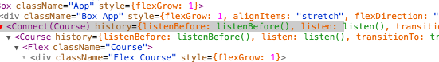

## 3.3 Frontend
### Component Index
Below is a list of all the components in the app. All "dumb" components are in the `views/ui` folder and the smart are contained in the `views/app` and `views/parser` directories.

<ul class="frontend">
    <li><span style="color:#39B9E9;font-family:monospace;">views/</span></li>
    <ul>
        <li><a href="https://github.com/adriancooney/examist/tree/master/client/src/views/Root.jsx"><code>Root</code></a></li>
        <li><span style="color:#39B9E9;font-family:monospace;">app/</span></li>
        <ul>
            <li><a href="https://github.com/adriancooney/examist/tree/master/client/src/views/app/App.jsx"><code>App</code></a>, <a href="https://github.com/adriancooney/examist/tree/master/client/src/views/app/Course.jsx"><code>Course</code></a>, <a href="https://github.com/adriancooney/examist/tree/master/client/src/views/app/CoursePicker.jsx"><code>CoursePicker</code></a>, <a href="https://github.com/adriancooney/examist/tree/master/client/src/views/app/Dashboard.jsx"><code>Dashboard</code></a>, <a href="https://github.com/adriancooney/examist/tree/master/client/src/views/app/Logout.jsx"><code>Logout</code></a>, <a href="https://github.com/adriancooney/examist/tree/master/client/src/views/app/Notes.jsx"><code>Notes</code></a>, <a href="https://github.com/adriancooney/examist/tree/master/client/src/views/app/Paper.jsx"><code>Paper</code></a>, <a href="https://github.com/adriancooney/examist/tree/master/client/src/views/app/Question.jsx"><code>Question</code></a>, <a href="https://github.com/adriancooney/examist/tree/master/client/src/views/app/Solutions.jsx"><code>Solutions</code></a>, <a href="https://github.com/adriancooney/examist/tree/master/client/src/views/app/routes.jsx"><code>routes</code></a></li>
        </ul>
        <li><span style="color:#39B9E9;font-family:monospace;">pages/</span></li>
        <ul>
            <li><a href="https://github.com/adriancooney/examist/tree/master/client/src/views/pages/Error404.jsx"><code>Error404</code></a>, <a href="https://github.com/adriancooney/examist/tree/master/client/src/views/pages/Login.jsx"><code>Login</code></a>, <a href="https://github.com/adriancooney/examist/tree/master/client/src/views/pages/Signup.jsx"><code>Signup</code></a></li>
        </ul>
        <li><span style="color:#39B9E9;font-family:monospace;">parser/</span></li>
        <ul>
            <li><a href="https://github.com/adriancooney/examist/tree/master/client/src/views/parser/PDFView.jsx"><code>PDFView</code></a>, <a href="https://github.com/adriancooney/examist/tree/master/client/src/views/parser/Parser.jsx"><code>Parser</code></a>, <a href="https://github.com/adriancooney/examist/tree/master/client/src/views/parser/routes.jsx"><code>routes</code></a></li>
            <li><span style="color:#39B9E9;font-family:monospace;">panels/</span></li>
            <ul>
                <li><a href="https://github.com/adriancooney/examist/tree/master/client/src/views/parser/panels/HelpPanel.jsx"><code>HelpPanel</code></a>, <a href="https://github.com/adriancooney/examist/tree/master/client/src/views/parser/panels/InfoPanel.jsx"><code>InfoPanel</code></a>, <a href="https://github.com/adriancooney/examist/tree/master/client/src/views/parser/panels/QuestionsPanel.jsx"><code>QuestionsPanel</code></a></li>
            </ul>
        </ul>
        <li><span style="color:#39B9E9;font-family:monospace;">templates/</span></li>
        <ul>
            <li><a href="https://github.com/adriancooney/examist/tree/master/client/src/views/templates/Container.jsx"><code>Container</code></a>, <a href="https://github.com/adriancooney/examist/tree/master/client/src/views/templates/Footer.jsx"><code>Footer</code></a>, <a href="https://github.com/adriancooney/examist/tree/master/client/src/views/templates/Header.jsx"><code>Header</code></a></li>
        </ul>
        <li><span style="color:#39B9E9;font-family:monospace;">ui/</span></li>
        <ul>
            <li><a href="https://github.com/adriancooney/examist/tree/master/client/src/views/ui/Avatar.jsx"><code>Avatar</code></a>, <a href="https://github.com/adriancooney/examist/tree/master/client/src/views/ui/Back.jsx"><code>Back</code></a>, <a href="https://github.com/adriancooney/examist/tree/master/client/src/views/ui/Empty.jsx"><code>Empty</code></a>, <a href="https://github.com/adriancooney/examist/tree/master/client/src/views/ui/Icon.jsx"><code>Icon</code></a>, <a href="https://github.com/adriancooney/examist/tree/master/client/src/views/ui/Institution.jsx"><code>Institution</code></a>, <a href="https://github.com/adriancooney/examist/tree/master/client/src/views/ui/Loading.jsx"><code>Loading</code></a>, <a href="https://github.com/adriancooney/examist/tree/master/client/src/views/ui/Markdown.jsx"><code>Markdown</code></a>, <a href="https://github.com/adriancooney/examist/tree/master/client/src/views/ui/Removed.jsx"><code>Removed</code></a></li>
            <li><span style="color:#39B9E9;font-family:monospace;">comment/</span></li>
            <ul>
                <li><a href="https://github.com/adriancooney/examist/tree/master/client/src/views/ui/comment/Comment.jsx"><code>Comment</code></a>, <a href="https://github.com/adriancooney/examist/tree/master/client/src/views/ui/comment/Comments.jsx"><code>Comments</code></a></li>
            </ul>
            <li><span style="color:#39B9E9;font-family:monospace;">course/</span></li>
            <ul>
                <li><a href="https://github.com/adriancooney/examist/tree/master/client/src/views/ui/course/CourseLink.jsx"><code>CourseLink</code></a>, <a href="https://github.com/adriancooney/examist/tree/master/client/src/views/ui/course/CourseList.jsx"><code>CourseList</code></a>, <a href="https://github.com/adriancooney/examist/tree/master/client/src/views/ui/course/CoursePlaceholder.jsx"><code>CoursePlaceholder</code></a></li>
            </ul>
            <li><span style="color:#39B9E9;font-family:monospace;">editor/</span></li>
            <ul>
                <li><a href="https://github.com/adriancooney/examist/tree/master/client/src/views/ui/editor/Editor.jsx"><code>Editor</code></a>, <a href="https://github.com/adriancooney/examist/tree/master/client/src/views/ui/editor/Preview.jsx"><code>Preview</code></a>, <a href="https://github.com/adriancooney/examist/tree/master/client/src/views/ui/editor/Textarea.jsx"><code>Textarea</code></a></li>
            </ul>
            <li><span style="color:#39B9E9;font-family:monospace;">error/</span></li>
            <ul>
                <li><a href="https://github.com/adriancooney/examist/tree/master/client/src/views/ui/error/ErrorMessage.jsx"><code>ErrorMessage</code></a>, <a href="https://github.com/adriancooney/examist/tree/master/client/src/views/ui/error/ErrorPage.jsx"><code>ErrorPage</code></a></li>
            </ul>
            <li><span style="color:#39B9E9;font-family:monospace;">input/</span></li>
            <ul>
                <li><a href="https://github.com/adriancooney/examist/tree/master/client/src/views/ui/input/Button.jsx"><code>Button</code></a>, <a href="https://github.com/adriancooney/examist/tree/master/client/src/views/ui/input/Field.jsx"><code>Field</code></a>, <a href="https://github.com/adriancooney/examist/tree/master/client/src/views/ui/input/Form.jsx"><code>Form</code></a>, <a href="https://github.com/adriancooney/examist/tree/master/client/src/views/ui/input/Input.jsx"><code>Input</code></a>, <a href="https://github.com/adriancooney/examist/tree/master/client/src/views/ui/input/Select.jsx"><code>Select</code></a>, <a href="https://github.com/adriancooney/examist/tree/master/client/src/views/ui/input/Textarea.jsx"><code>Textarea</code></a></li>
            </ul>
            <li><span style="color:#39B9E9;font-family:monospace;">layout/</span></li>
            <ul>
                <li><a href="https://github.com/adriancooney/examist/tree/master/client/src/views/ui/layout/Box.jsx"><code>Box</code></a>, <a href="https://github.com/adriancooney/examist/tree/master/client/src/views/ui/layout/Flex.jsx"><code>Flex</code></a>, <a href="https://github.com/adriancooney/examist/tree/master/client/src/views/ui/layout/FlexBox.jsx"><code>FlexBox</code></a>, <a href="https://github.com/adriancooney/examist/tree/master/client/src/views/ui/layout/Solid.jsx"><code>Solid</code></a></li>
            </ul>
            <li><span style="color:#39B9E9;font-family:monospace;">notes/</span></li>
            <ul>
                <li><a href="https://github.com/adriancooney/examist/tree/master/client/src/views/ui/notes/Note.jsx"><code>Note</code></a>, <a href="https://github.com/adriancooney/examist/tree/master/client/src/views/ui/notes/NoteForm.jsx"><code>NoteForm</code></a>, <a href="https://github.com/adriancooney/examist/tree/master/client/src/views/ui/notes/NoteLink.jsx"><code>NoteLink</code></a>, <a href="https://github.com/adriancooney/examist/tree/master/client/src/views/ui/notes/Notes.jsx"><code>Notes</code></a></li>
            </ul>
            <li><span style="color:#39B9E9;font-family:monospace;">paper/</span></li>
            <ul>
                <li><a href="https://github.com/adriancooney/examist/tree/master/client/src/views/ui/paper/PaperDot.jsx"><code>PaperDot</code></a>, <a href="https://github.com/adriancooney/examist/tree/master/client/src/views/ui/paper/PaperFooter.jsx"><code>PaperFooter</code></a>, <a href="https://github.com/adriancooney/examist/tree/master/client/src/views/ui/paper/PaperGrid.jsx"><code>PaperGrid</code></a>, <a href="https://github.com/adriancooney/examist/tree/master/client/src/views/ui/paper/PaperInfo.jsx"><code>PaperInfo</code></a>, <a href="https://github.com/adriancooney/examist/tree/master/client/src/views/ui/paper/PaperLink.jsx"><code>PaperLink</code></a></li>
            </ul>
            <li><span style="color:#39B9E9;font-family:monospace;">parser/</span></li>
            <ul>
                <li><a href="https://github.com/adriancooney/examist/tree/master/client/src/views/ui/parser/Panel.jsx"><code>Panel</code></a></li>
            </ul>
            <li><span style="color:#39B9E9;font-family:monospace;">question/</span></li>
            <ul>
                <li><a href="https://github.com/adriancooney/examist/tree/master/client/src/views/ui/question/Marks.jsx"><code>Marks</code></a>, <a href="https://github.com/adriancooney/examist/tree/master/client/src/views/ui/question/Question.jsx"><code>Question</code></a>, <a href="https://github.com/adriancooney/examist/tree/master/client/src/views/ui/question/QuestionActions.jsx"><code>QuestionActions</code></a>, <a href="https://github.com/adriancooney/examist/tree/master/client/src/views/ui/question/QuestionPath.jsx"><code>QuestionPath</code></a>, <a href="https://github.com/adriancooney/examist/tree/master/client/src/views/ui/question/Questions.jsx"><code>Questions</code></a></li>
            </ul>
        </ul>
    </ul>
</ul>

<div style="page-break-after: always;"></div>

### Router
The router is the entry part of the application. The router dictates what components to mount and thus what part of the app to initialise. The router itself is a React component and works much like any other component. It has `Route` components which describe the URLs and support nesting as you'd expect.

```html
<Route component={App} onEnter={authorize}>
    <IndexRoute component={Dashboard} />
    <Route path="logout" component={Logout} onEnter={Logout.onEnter} />
    <Route path="courses/pick" component={CoursePicker} />
    <Route path="course/:course" component={Course}>
        <Route path="paper/:year/:period/q/:path(/:view)" component={Question} />
        <Route path="paper/:year/:period" component={Paper} />
    </Route>
</Route>
```
<center><i>The App routes configuration.</i></center>

In the above example, all matching components will be rendered as children to the `App` component (i.e. passed as `children` prop). If no route is matched, the `IndexRoute` will match and the `Dashboard` component will be rendered.
 
#### Direct linking
An extremely important part of the application experience is being able to direct link to content and have it load automatically without user interaction. This is trivial to implement (i.e. how they operate) with server-side rendering but a very hard problem in client side apps. The client must decide what to load for the user and how all in a split second when the page loads.

React router is able to match a deep linked URL and mount the correct components who once mounted, continue loading the application from the API. It is for this reason that every component that matches a route *must be a smart component*. Smart components can tell the state what data to load and select it from the state.

#### Back Button
Another seemingly simple function that is difficult problem in web applications is navigating back throughout the app's history. With the combination of the state defined UI and React router, the ability to navigate forward and back through history is just a consequence of great design.

### Smart Components
The concept of smart and dumb components was discussed in the UI section of the 
Design chapter. In this section, we'll go through some of the concepts in more detail. Smart components are connected via the `react-redux` bindings. The bindings take two arguments, the state selector and a map of actions that the component will dispatch to mutate the state.

```js
connect(mapStateToProps, mapDispatchToActions)(Component)
```

#### State selector
Every smart component is connected to the state via selectors. Selectors are functions that, given the state object, return the required data to render the view *based on the current state*. Take for example, the Course component. It selects the course to render from the `resource.courses` state in it's selector. As a convention, the selector is stored as a static property on the component's class however it is passed as the `mapStateToProps` parameter in the `connect` react-redux bindings. The selector receives two parameters, the state and the props passed to the component.

```js
class Course extends Component {
	static selector = (state, { params }) => {
		return {
			course: state.resources.courses.find(course => {
				return course.code === params.course;
			});
		};
	};
}
```
<center><i>The course selector picking the current course from the state.</i></center>

There `params` object comes from React-Router and contains the parameters in the url (`/course/:course`). The returned object is then mapped to the component's props allowing state data to be accessed via `this.props`. This selector is run *every* time the state changes and since the components props changes, it causes a cascading re-render. This is why it's important to have a couple of *smart* components.

#### State mutation
To mutate or update the state, we use actions. Again, as a convention, the actions map is stored as a static property on the component's class but is passed as the second parameter `mapDispatchToActions` to the `connect` react-redux bindings. The actions map contains *action creators* which are essentially just functions that return simple objects that describe how to update the state. These actions are passed to the reducers. The react-redux binds the `dispatch` function to the action creators and passes them as props to the component by their key in the map.

```js
class Course extends Component {
	static actions = {
		selectPaper: model.Paper.selectPaper,
		comment: model.User.comment
	};
}
```

#### The `connect` binding
When the selector and actions map are created, it's just a matter of passing them to the `connect` binding from the `react-redux`. We then export the returned, wrapped component from the binding.

```js
export default connect(Course.selector, Course.actions)(Course);
```


<center><i>The connected Course component from the React Dev Tools panel.</i></center>

#### Saving selections with React's experimental `context`
The selectors for connected components became repetitive the further down the router tree you went because each smart component needed to access the same data. This is where the potential was spotted for React's `context`.

React has an experimental feature call `context` where you can pass data implicitly down the component tree and access it via a property called `contextTypes`. The `contextTypes` map specifies the keys to extract from the context and put into the components `this.context` property.

After modifying the `react-redux` bindings to introduce the context features, selectors could be thinned down and state already selected further up the component tree could be put into the context. It saved a lot of time and keystrokes without introducing unnecessary complexity to the application. See the selectors for the `Paper` and `Question` smart components for usage in context (no pun intended).

Tests still have to be created for the `react-redux` fork that includes context but I hope to create a pull request to include the code to the popular repository soon.

### API Communication
To communicate with the API, the new `fetch` API was utilised (with a polyfill for old browsers and Node). The `API` class is an abstraction over the `fetch` API and contains all the methods to communicate with the API. The class is based on a simple idea that works extremely effective:

* Instance methods are authenticated request methods.
* Static methods are unauthenticated request methods.

You can therefore create a new `API` object via `new API(<session key>)` and all subsequent requests to the API made via the instance will be authenticated. There are also other methods for creating authenticated instances:

* `API.login(<username>, <password>).then( api )`

	This method logs the user in via their credentials and if successful, returns a newly authenticated API instance with the users session key.
	
* `API.loginWithAuth( <session key> ).then( api )`

	Validate an auth key on the `/auth` endpoint and return an new authenticated instance if successful.
	
The authenticated API instance is stored in the state and can be accessed whenever authorised data needs to be loaded from the API. See the `src/API.js` for a full list of methods of communication with the API.

### Auto-login
A tricky part of the application logic is auto logging in a user who has a valid API key. Before we can auto-login a user, we have to check if their key saved locally is valid. This sounds a lot easier that it is because this is an **asynchronous** action.

This would have been made simple however a design flaw in the React-router makes the implementation more complicated. By design, React Router awaits async transition handlers to complete before rendering anything to the screen or even matching routes further down the routing tree. So if the app were to check if a user's key is valid on the `onEnter` hook of a router, a white screen would be left hanging since React-router awaits the completion of the async task before rendering anything or even matching further down the routing tree.

To account for this, the `Root.jsx` component goes against the principles of the entire rest of the application. It uses it's own state. It becomes the root component that when mounted, displays a loading screen and checks if the user's key is valid via the `API.loginWithAuth` API method. If the key is valid, it adds the user to the state and then returns the *entire* rest of the app as a replacement for the loading screen. The app now has the user already in the state and can continue to function normally. Had the user's key *not* been valid, the user would simple not exist and the app can perform a synchronous check and redirect to the login page.