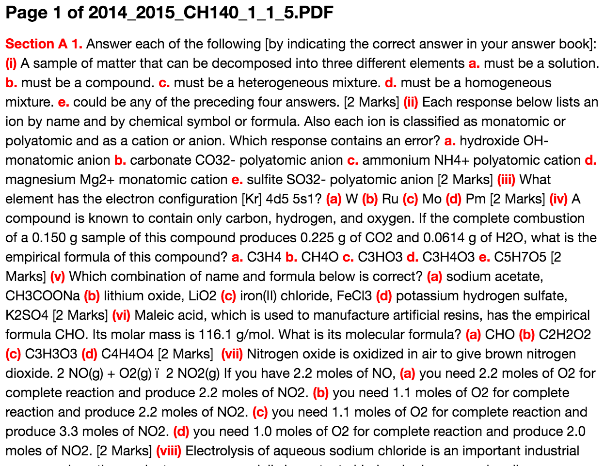

# Parsing the Exam Papers
Probably the biggest technical feat of this project was parsing the exam papers. The exam papers from NUI Galway were all stored in PDF format, unfortunately.

### PDF Format
The PDF format specification is *22 years old* and is entirely backwards compatible. That means any features supported in version 1.0 of the specification are still supported the current version, 1.7. This is good for users of the PDF format because even the oldest PDFs will still work however not for developers who want to use the contents of the PDF. The format is full of old concepts, quirks and dead techniques that have plagued anyone attempting to peek under the hood. Luckily for this project, the PDF format was never accessed directly but through libraries in Python. Some libraries reviewed:

* **PDFMiner** - A full suite of amazing tools for parsing *everything* about a PDF however documentation is next to nil which makes it's a non-viable candidate.
* **Slate** - A very simple library that will load the PDF and extract the text (based on PDFMiner).

Some external tools were also tested:

* **pdftotext** - Command line tool to extract the text contents of a PDF by the Poppler project.
* **pdftohtml** - Another command line tool that converts a PDF to HTML (or XML).
* **Tesseract** - An Optical Character Recognition (OCR) library to extract the contents of the PDF.

However easy it was to access the data, one fact remains: **PDF is only about presentation, not structure.** The outputted data was not easy to parse. Content extracted via the libraries and tools was unstructured and unformatted. Tables, math formula, question indexes, titles and event text decoration would all corrupt the output.


<center><i>Example of the output produced by `pdftotext` with Math formulas.</i></center>

## Parsing the PDF contents
### Structure of the exam paper
Before starting to extract the data from the PDF, the structure of the underlying data must be understood. From tests across multiple papers, no consistent structure was observed over the exam papers. Below are some observations of consistencies and inconsistencies between papers.

#### Consistencies between exam papers
1. The first page in an exam paper described the exam paper itself. It contained metadata on the years, examiners, lecturers and classes.
2. Each page in an exam paper had a page number in the footer.

#### Inconsistencies between exam papers
1. Exam paper metadata did not have any discernable structure and the labels could appear in any order or not at all.
2. Exam questions could appear indexed numerical, alphabetical and using roman numerals. e.g. `a, b, c` or `i, ii, iii`.
3. Exam question indices did following any formatting style. Indices could be any of the following form: `(a)`, `(a.)`, `(1).`, `[i]`, `iii.`, `B.`, `1.`, `Q1.`, `Question 2`, or just the index itself, `c`.
4. Some exam papers used sections while others did not e.g. `Section A`.
5. Some exam papers displayed marks after each question while others did not.
6. Exam papers displayed marks using square brackets `[10]` or parenthesis `(10)`. Some also included the label `marks`.
7. Sub-questions and multiple-choice answers would be indexed in the same format and style. e.g. `1. 1.` instead of `1. a.`.
8. Sub-questions and multiple-choice answers wouldn't be indexed at all.
10. Some exam questions were indexed improperly or ordered wrong. e.g. `1., 2., 4., 5., 6.`.
9. Exam papers could be written by two or more people who each chose they own style of formatting. These exam papers had multiple, inconsistent styles between *questions*.

### Extract indices with a Context Free Grammar
The main attempt at parsing the contents of the PDF to extract the exam paper's structure and all it's questions was via a Context Free Grammar (CFG). The grammar was used to extract the indices of each question and therefore build a usuable representation of the paper structure from the indices. The CFG was created using the Pyparsing library that allowed for constructing complex grammars using simple syntax.

The grammar was constructed to extract all the indices from the paper. It was designed to be as loose as possible to include all the types of indices (alphabetical, numerical, roman) and all their formats (square brackets, parenthesis). Whitespace and sections were also accounted for within the grammar.

```py
import pyparsing as pp

# The exam paper CFG
_ = (pp.White(exact=1) | pp.LineEnd() | pp.LineStart()).suppress()
__ = pp.White().suppress()
___ = pp.Optional(__)
____ = pp.Optional(_)

# Define tokens for numerical, alpha and roman indices
# Max two digits for numerical indices because lecturers aren't psychopaths
index_digit = pp.Word(pp.nums, max=2)\
	.setParseAction(lambda s, l, t: [Index("decimal", int(t[0]))])("[0-9]") 
	
index_alpha = pp.Word(pp.alphas, exact=1)\
	.setParseAction(lambda s, l, t: [Index("alpha", t[0])])("[a-z]")
	
index_roman = pp.Word("ivx")\ # We only support 1-100 roman numerals
	.setParseAction(lambda s, l, t: [Index("roman", t[0])])("[ivx]") 
	
index_type = (index_digit | index_roman | index_alpha)("index")

# Define token for ("Question" / "Q") + "."
question = (pp.CaselessLiteral("Question") + pp.Optional("."))("question")

# Define tokens for formatted indices e.g [a], (1), ii. etc.
index_dotted = (
	index_type + pp.Literal(".").suppress()
).setParseAction(lambda s, l, t: t[0].setNotation("dotted"))
    
index_round_brackets = (
	pp.Optional(pp.Literal("(")).suppress() + index_type + \
	pp.Literal(")").suppress()
).setParseAction(lambda s, l, t: t[0].setNotation("round"))
    
index_square_brackets = (
	pp.Literal("[").suppress() + index_type + \
	pp.Literal("]").suppress()
).setParseAction(lambda s, l, t: t[0].setNotation("square"))
    
index_question = (
	pp.Word("qQ", exact=1).suppress() + \
	pp.Optional(".").suppress() + index_type + \
	pp.Optional(".").suppress()
).setParseAction(lambda s, l, t: t[0].setNotation("question"))

# Define final index token with optional 
# question_index token before formatted index
qindex = (
    # Whitespace is required before each index 
    # (e.g. "hello world." the d. would be take for an index)
    _ + \
    # Optional "Question." before
    pp.Optional(question + ___).suppress() + \
    # The index
    (index_question | index_dotted | \
    	index_round_brackets | index_square_brackets) + \
    # Required whitespace *after* index
    _
)

# Define a section header
section = (
	pp.CaselessKeyword("Section").suppress() + \
	__ + index_type + _
).setParseAction(
    lambda s, l, t: [t[0].section()]
)("section")

# Entry point for the parser
entry = section ^ qindex
```

The grammar was made up of a set of tokens. Each token is made up of literals (strings) or other tokens. The gramar had three tokens to define an index itself: `index_digit`, `index_alpha` and `index_roman` and a final `index_type` that combined the three to match all. It then defined three more tokens for the index formatting style in that wrapped the `index_type`, one for parenthesis (`( index_type )`), square brackets (`[ index_type ]`) and the dotted form (`index_type .`). Those style forms were then combined to create `qindex` token which also accounted for an optional prefix of `Q` or `Question` in the index. For something to be an `qindex`, it had to have whitespace before and after the matched token. This was to prevent matching numbers or symbols mid-question. The second last token then was a `section` which combined the literal "Section" and `index_type`. Finally, the entry point for the grammar was to match either a `section` or `qindex`.

When the grammar was run on the input text from the PDF, it iterated over each character in the text and checked if that character matched the entry token, it ran the *parser action* for each token. These parser actions are defined using the method `setParseAction` on the rule and passing a `lambda` function with parameters containing information about the matching rules. Any return value from those actions replace the *match* from that rule. Also notice in the grammar above, some rules output could be surpressed by calling the `surpress` method which dropped that rule from the *match*.

The parser actions for the above tokens created `Index` objects for `index_type` which attributes were modified as they matched other rules. Eventually, the results returned an array of `Index`s with contained the index type (`alpha`, `decimal`, `roman`), the formatting style (`dotted`, `round`, `square`) and whether is was a section or prefixed with a `Question`.

There were some major caveats to the parser:

1. Sentences ending with a digit and period are picked up as indices.
2. General formatting or referencing another question within a question are picked up as indices.
3. Some formatted math are picked up as indices e.g. `x * (y)`.
4. Some mark forms at the end of questions are picked up as indicies.
5. The PDF format usually botched the whitespace from the text leaving some indices without enclosing whitespace and therefore not included as an indice.

#### Results
The grammar had moderate results for extracting the indices. It performed extremely well on formatting loosely based on the grammar but poor on papers that adopted an unusual style or with complex formatting.


<center><i>Example output: The matching indices on a real exam paper.</i></center>

### Creating the question tree
The grammar was useful for extracting the indices however the data returned from the grammar unprocessed is useless. It's the content between the indices, the questions, is what the project is after.

The exam papers are based on a heirarchy 