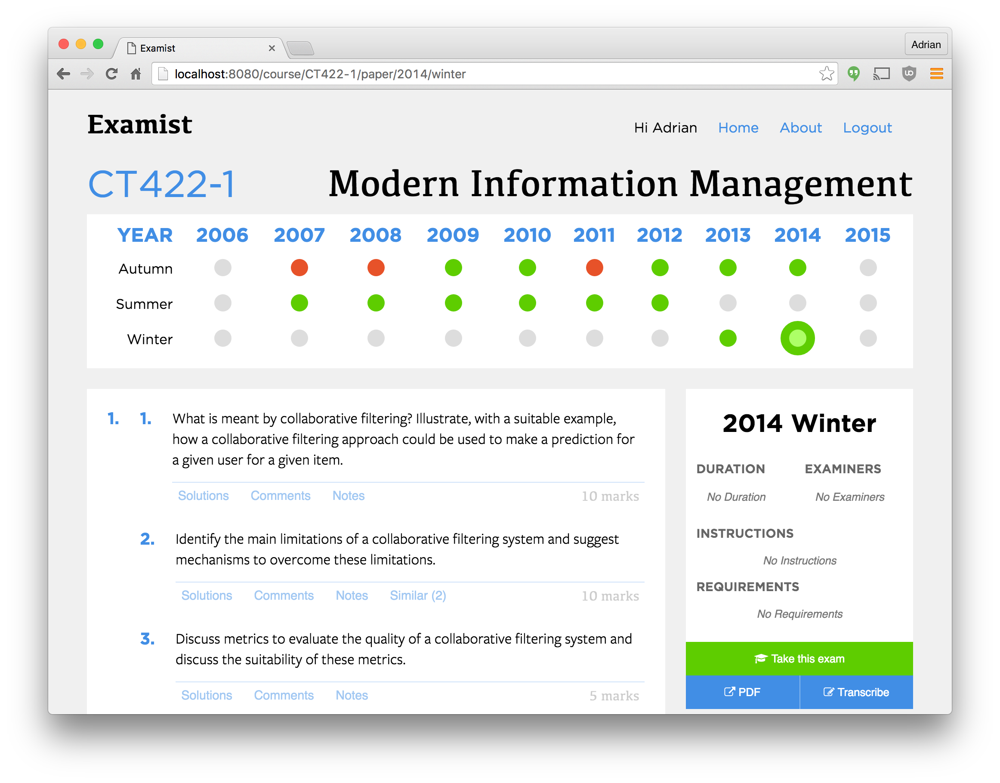
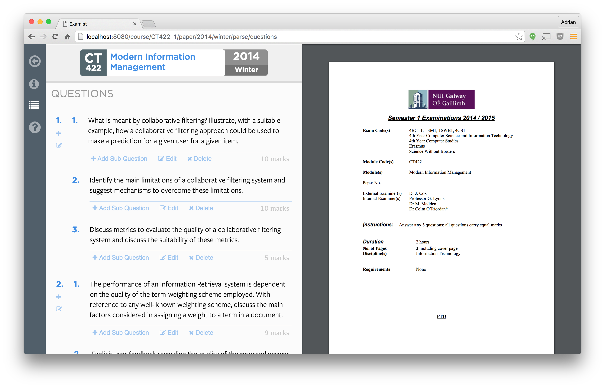

# 6. Results
The product of all the hard work put into this Final Year Project is a fully functioning online application that is accessible via:

<a style="font-size:32px;" href="http://examist.xyz">http://examist.xyz</a>

Anyone can create an account, log in and get started adding their courses. Users can start to transcribe their papers and build the question index for modules. In other words, the application is *useful*.

### Features
The features that were implemented are listed below (not a comprehensive list):

* Single page application.
* User accounts.
* Pick your own courses.
* View popular questions in a course.
* View exam papers.
* Get external links to PDF.
* Comment on questions.
* Post notes to questions.
* View similar for questions.

### Into the Future
The future for the project is to hopefully make it available online for all students to help solve the problem of accessing exam papers and their solutions. The content of the application relies on users for it's crowd sourced content so without them, it's lifeless.

Once enough exam papers are transcribed, hopefully that will create enough data to allow for machine learning algorithms to take over and be trained to automatically and **accurately** extract the questions from the paper.

From there, the application should be opened to all forms of institutions. Other colleges, the Leaving Cert and any courses with exams could be made available on the system to allow the system to grow and understand users.

After course data is collected, topic clouds could be generated to give users an overview of certain courses and disciplines. Automatically link similar courses between colleges and materials to create a truly open and sharing learning environment.

When multiple courses from different colleges are collected, exam papers could be generated by extracting related questions to test the users themselves in preparation for the real exam.

**Screenshots**

### Open Source Contributions
All of the software used in the creating of this application is *open source* and it is unfair to only take without giving. Here are some of the contributions to the open source this project had:

* 1 release library: `redux-pending` - https://github.com/adriancooney/redux-pending
* Filing bugs & issues:
	* https://github.com/reactjs/react-redux/issues/275
	* https://github.com/reactjs/react-redux/issues/289#issuecomment-201638203
* Stack overflow answers:
	* http://stackoverflow.com/questions/35625834/ebook-convert-spits-out-python-error-can-someone-understand-the-error/36377027#36377027