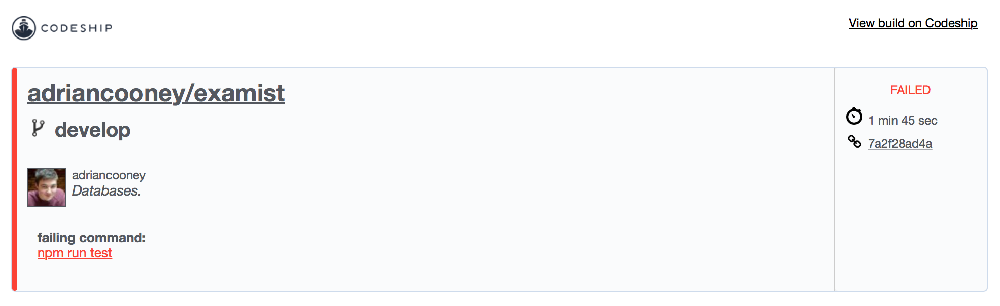

## 5.2 Continuous Integration
As part of the development and testing process, it is important to run tests as often as possible to ensure no parts of the app are broken as a consequence of some change. As the test suite grows, so does the time it takes to run the tests. If the tests are being ran after each change, the development process is being slowed down. With Continuous Integration, this testing overhead is removed and offloaded to a third party.

### Codeship
Codeship is a third party service that setups up the test environment for application and runs the test suites. If the tests fail, a notification is sent to the developer with a link to the problem. Tests are run in response to code pushes to the remote repository. For example, if a breaking change was made to API that broke some tests and committed it. After a push:

	$ git push origin my-feature
	
An email would be received with a notification detailing that the tests were broken and that they needed to be fixed.

