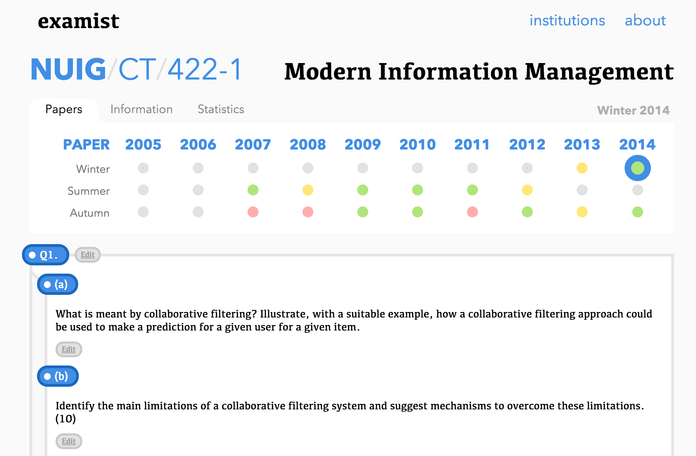
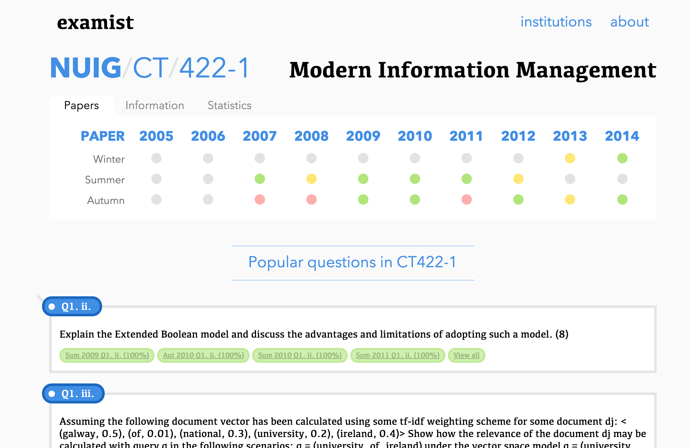

# Introduction
This is a project definition document for the online, collaborative, exam focused study platform for National University of Ireland Galway students.

# Opportunity
Exams are the culmination of all formal learning. They test the knowledge on all topics within a subject. An exam expects you to know your domain and can ask anything about within that domain. Exams are the defacto standard to test ones knowledge on a subject and are therefore authority on a subject. Therein lies a goldmine of data. Exam papers describe what you should know about a subject and to what extent. By marrying this style of learning with an online, collaborative community, a huge positive impact could be had across a large number of students. Learning isn't just meant to be something somebody should do in isolation, there is an inherent community aspect and there are endless things you can with accomplish.

# Purpose
The purpose of this project is to create an online platform where students can learn about their subject and focus on the topics covered in exam papers. It will allow students to adequately prepare themselves for an exam in a focused manner. Students can collaborate with their classmates in a controlled environment where everyone has a voice. The vision of this project is to help all students find a new way to learn and increase their final scores.

# Objectives
### Collaboration
- **Wiki-style editing of solutions (with revision history)**.
    
    It will be important to retain version history and reasons for edits in solutions so content can be reverted back to an original state. Using git to version control the history will be explored.

- **Tag and organize questions by topics.**

    By organizing tasks by tags, users will be able to browse related questions and get questions on topics they are studying on via a single click. Normally, a user would have to trawl through each exam paper manually searching for keywords which is a painful, tedious process.

- **Add related links to questions and lecture notes and upvote links based on quality.**

    Finding quality learning material outside of the course material is a hard task and generally requires much sifting through of irrelevant, outdated or just bad content online. By allowing users to share links to quality online content and allowing users to vote on the best content, not only will this be a platform to test your knowledge but to also learn.

- **Exam tips such as how much time to spend on a question.**

    Each paper is allocated a set time and many students find it difficult to divide their time between questions. With this feature, students would be able to get at a glance how much time they should spend on this question given the time constraints and exam instructions allowing them to better use their time and achieve a better result.

- **Add hints, annotations and highlight important content in questions.**

    Another major problem with exams questions is understanding the question itself. Through this feature, students could annotate ambiguous parts of questions to make it more understandable to the reader.

- **Rate question on difficultly, relevancy and priority.**

    Often students encounter the problem of studying irrelevant material for exams because the course may have changed or the content of the question is outdated. To combat this problem, students would be allowed to rate questions on their difficultly, relevancy and priority within the module.

- **Comments on questions and solutions.**

    To compound the collaborative aspect, users will be able to comment on questions and ask for help on problems. Conversations like this are critical to the learning process and allow students to get information in an informal manner they wouldn't have in a classroom.

- **Class groups**

    Course would be able to define modules within them and users can join the group and receive updates on relevant information on the exam paper.

### Exam paper analysis.
- **View topics in paper.**
    
    Get insight into the topics covered in a paper by analyzing questions that came up that year.

- **View frequent questions.**

    View popular questions within an exam paper and practice them since their content is imperative to the understanding of the module.

- **Inspect how marks are distributed on the paper.**

    Students can view how marks are distributed to different questions and what matters most on the paper.

- **View exam paper instructions, authors.**

    To complete an exam, students must first understand the requirements of the exam. Utilizing this feature, students would be able to inspect how the exam is laid out, what questions to answer and the time allocated to it.

### Exam paper explorer.
- **A better interface to `mis.nuigalway.ie`.**

    Let's face it, `mis.nuigalway.ie` is *severely* outdated. A better exam paper browsing is dearly needed because searching using the old interface is slow and tedious. This feature would allow users to view all exam papers from a single page and get an overview of the history of the course.

- **Search questions.**

    A very critical part of the learning process is finding questions to test your knowledge on a topic. Normally, that means picking a topic, opening every exam paper and scanning through each to find the relevant questions to complete. By introducing search functionality, users would be able to return a result set and skip the tedious process of finding questions manually.

- **Get module overview such topics that have been covered.**

    Finding a starting point for studying is often a very hard task for students. By giving students a high level overview of what needs to be covered for the exams, they can decide where to begin studying and work from there. This feature would provide a high level overview of all the topics covered in the module.

### Examiner (exam preparation)
- **Let students take exams.**
    
    Test students by creating exam style environment and conditions. A timer will be place on a page a paper can be selected to examine the student on. Timing and question hints will be provided to the student as they progress through the exam.

- **Generate random exam paper from past questions.**

    Using the data from past papers, the online platform will be able to generate unseen papers by selecting different questions that accurately reflect the structure of the exam. This unseen exam paper may then be taken by the student to test their knowledge.

- **Show questions completed and questions not completed.**

    Students will be able to view questions they have already completed to save them repeating study. We will NOT attempt to correct their answers but simply save them for revisiting.

# Technology
This will be an online project. The technology for this project would be split up into two parts, frontend and backend. Each part will interact with the other heavily.

## Frontend
The frontend will be built atop modern HTML5 technologies that are todays standard on build Single Page Applications. The following libaries, frameworks and tools will be used:

* React, a popular javascript library by Facebook, will be used to create the user interface for the app. It's commonly reffered to as the "V" in MVC (Model-View-Controller). It allows the application to be decomposed into reusable, testable components that can be combined together to build an extremely performant and usable application.
* Redux could be described as the Model for the application however it's a radically methodology for building user interface than your common patterns. It forces the designer to have a single object that describes the state for the *entire application*. To update the state, the designer dispatches *actions* in response to user input which updates the state. This allows the designer to completely decouple the state from the UI for a streamlined testing experience since the application has zero side-effects or unintended behavior.
* SASS, a superset of CSS and preprocessor, will be used to seperate the CSS into modules on a component scale.
* Webpack, a source compiler, will bring all these technologies together into a single package for distribution on the web

### Paper Parser
The exam paper parser will be a graphical user interface for parsing exam papers. Users will be able to view their exam papers, highlight questions and associate their index in the paper (such as "Section A, part b."). This process will only need to be completed once.

### Examiner
The "Examiner" interface will act as a exam environment allowing students to attempt an exam paper in real exam conditions. It will allow users to get hints for questions and show the time allocated for each questions. A clock will be present and run down from the allocated time for the exam. Users will be able to pause 

### Exam explorer
This will allow users to browse past exam papers with ease. It will show past questions for each paper and have the functionality to upload, edit and comment on solutions in a wiki-style revision control system. Users will also be able to post relevant links to learning materials and rate based on quality.

## Backend
The backend will be coded in Python and powered by a Flask and SQL Alchemy teamset. Flask will power the HTTP API side of things which will use SQL Alchemy as the ORM to interface with our RDBMS of choice, PostgreSQL.

### API
The API will be designed according to the RESTFUL style and will respond with simple JSON. The frontend will interact via this API with simple header based authentication. Each endpoint will be tested, secure and only respond to valid data without side-effects.

### Database
A relational database will power the persistence side of things. PostgreSQL will be the RDBMS of choice and SQL Alchemy for the ORM. This will store all the content of the exam papers from the modules to paper questions. For version control of the question content, git may be explored as an alternative.

### Static Server
Static assets do not need to be served by the Flask API since they don't change during the applications lifetime. The assets will be served with Nginx, an extremely fast HTTP server. Nginx will serve all the Javascript, CSS and HTML assets to the users.

### Deployment
A container based format will be used to deploy the app such as Docker. Docker allows the application environment to be replicated exactly when developing as it would be in production. It uses a declarative application description language that automatically generates the application environment on demand.

# Deliverables
* Fully versioned control source code with detailed log.
* Modular and tested codebase.
* Usable, aesthetically pleasing application design.
* Functionality outlined above in objectives with features feasible in the given timeline.
* Deployable application in a container based format.
* An online application with active users under a valid domain.

# Schedule
This is a high level schedule for the following months working on the project. It does not account for the inevitable time spent fixing bugs and research that may be required to complete tasks so purposefully not all time is accounted for.

------------ --------------------------------------------------------------------------
Week         Completed                              
------------ --------------------------------------------------------------------------
1, 2         User interface research, design considerations and choices.
             Building foundations for UI with React, react-router and Redux.

3, 4,        Building RESTFUL API backend using Python, Flask and SQL 
             Alchemy. Design decisions and research. User login and authentication.

5, 6, 7, 8   Building interface elements: Signup, module picker, module viewer, paper 
             parser, paper viewer, solution poster, commenting, link voting.

9            Containerizing, deploying online and initial MVP release.

10           Building exam paper generator and tester.
------------ --------------------------------------------------------------------------